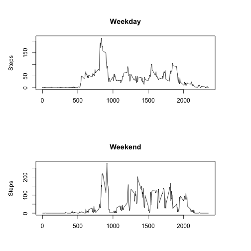

## Unzip and load the activity file

```r
unzip("activity.zip")
activity <- read.csv2("activity.csv", sep=",")
activity$steps <- as.numeric(as.character(activity$steps))
activity$date <- as.Date(as.character(activity$date))
activity$interval <- as.numeric(as.character(activity$interval))
head(activity)
```

```
##   steps       date interval
## 1    NA 2012-10-01        0
## 2    NA 2012-10-01        5
## 3    NA 2012-10-01       10
## 4    NA 2012-10-01       15
## 5    NA 2012-10-01       20
## 6    NA 2012-10-01       25
```


## What is mean total number of steps taken per day?

Total steps per day:

```r
stepsByDay <- aggregate(steps ~ date, activity, sum)
mean(stepsByDay$steps)
```

```
## [1] 10766.19
```


```r
hist(stepsByDay$steps,
     ylim=range(0, 30),
     main="Histogram of Steps per Day",
     xlab="Steps per day")
```


Mean steps per day:

```r
mean(stepsByDay$steps)
```

```
## [1] 10766.19
```

Median steps per day:

```r
median(stepsByDay$steps)
```

```
## [1] 10765
```

## What is the average daily activity pattern?

Average day activity:

```r
stepsByInterval <- aggregate(steps ~ interval, activity, mean)
plot.ts(stepsByInterval$interval, stepsByInterval$steps, xlab="Interval", xy.lines=TRUE, type="n", ylab = "Steps")
```


Highest average activity 5 minute period:

```r
interval <- stepsByInterval[stepsByInterval$steps == max(stepsByInterval$steps), ]$interval
```
The average highest activity was the 5 minute interval starting at 835 minutes since midnight

## Accounting for missing values

Total number of missing values:

```r
length(which(is.na(activity$steps)))
```

```
## [1] 2304
```

Estimate missing values by filling with average across all days for the given interval

```r
filledActivity <- activity
intervalMeans <- round(merge(activity, stepsByInterval, by.x="interval", by.y="interval")$steps.y)
missingStepIndices <- which(is.na(activity$steps))
filledActivity[missingStepIndices, 1] <- intervalMeans[missingStepIndices]
filledStepsByDay <- aggregate(steps ~ date, filledActivity, sum)
```


```r
hist(filledStepsByDay$steps,
     ylim=range(0, 30),
     main="Histogram of Steps per Day (missing values estimated)",
     xlab="Steps per day")
```


Mean steps per day (missing values estimated):

```r
mean(filledStepsByDay$steps)
```

```
## [1] 10889.46
```

Median steps per day (missing values estimated):

```r
median(filledStepsByDay$steps)
```

```
## [1] 11015
```

Filling missing values with estimates increased mean and median steps per day slightly.  
It also allowed us to account for additional days, which seemed to be biased toward the extremes, somewhat flattening the original histogram.

## Are there differences in activity patterns between weekdays and weekends?


```r
dayOfWeek <- weekdays(activity$date)
activity$kindOfDay <- as.factor(ifelse(dayOfWeek == "Saturday", "weekend", "weekday"))

weekendActivity <- activity[activity$kindOfDay == "weekend", ]
weekdayActivity <- activity[activity$kindOfDay == "weekday", ]

par(mfrow=c(2,1), pin=c(5, 1.5))

weekdayStepsByInterval <- aggregate(steps ~ interval, weekdayActivity, mean)
plot.ts(weekdayStepsByInterval$interval, weekdayStepsByInterval$steps, xy.lines=TRUE, type="n", main="Weekday", ylab = "Steps", xlab="")

weekendStepsByInterval <- aggregate(steps ~ interval, weekendActivity, mean)
plot.ts(weekendStepsByInterval$interval, weekendStepsByInterval$steps, xy.lines=TRUE, type="n", main="Weekend", ylab = "Steps", xlab="")
```



